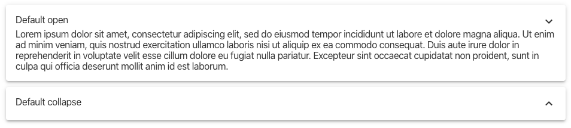
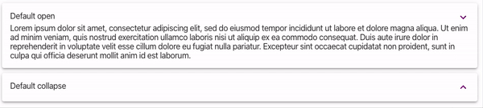

# mds-accordion

# mckesson-design-system accordion
A styled accordion or expandable panel that allows for a header and content. the component will dynamically expand to the size of the contents.

## Installation

### npm
```bash
npm i `@mcklabs/mds-accordion` --save
```

### yarn
```bash
yarn add `@mcklabs/mds-accordion`
```

### Rendered


### Usage

```html
<mds-accordion elevation="6" state="open">
<div slot="accordion-header">Default open</div>
<div slot="accordion-content">
   Lorem ipsum dolor sit amet, consectetur adipiscing elit, sed do eiusmod tempor incididunt ut
   labore et dolore magna aliqua. Ut enim ad minim veniam, quis nostrud exercitation ullamco
   laboris nisi ut aliquip ex ea commodo consequat. Duis aute irure dolor in reprehenderit in
   voluptate velit esse cillum dolore eu fugiat nulla pariatur. Excepteur sint occaecat
   cupidatat non proident, sunt in culpa qui officia deserunt mollit anim id est laborum.
</div>
</mwc-accordion>
```

### React Component

```jsx
import `@mcklabs/mds-accordion`

export const accordion = () => (
<mds-accordion
   elevation={6}
>
   <div slot="accordion-header">Default collapse</div>
   <div slot="accordion-content">
     Lorem ipsum dolor sit amet, consectetur adipiscing elit, sed do eiusmod tempor incididunt ut
     labore et dolore magna aliqua. Ut enim ad minim veniam, quis nostrud exercitation ullamco
     laboris nisi ut aliquip ex ea commodo consequat. Duis aute irure dolor in reprehenderit in
     voluptate velit esse cillum dolore eu fugiat nulla pariatur. Excepteur sint occaecat
     cupidatat non proident, sunt in culpa qui officia deserunt mollit anim id est laborum.
   </div>
</mds-accordion>
)
```

### Set the following variables in your imported SCSS/CSS file or html `style` tag, before usage

```css
:root {
--mdsAccordionIconColor: purple;
--mdsAccordionIconColorHover: orange;
}
```

### Rendered in the browser


## Attributes

| Attribute | Type     | Default    | Description                                      |
|-----------|----------|------------|--------------------------------------------------|
| `state`   | `String` | "collapse" | Sets the initial state and can be toggled to open or close it |

## Properties

| Property    | Attribute   | Type     | Default | Description                                      |
|-------------|-------------|----------|---------|--------------------------------------------------|
| `elevation` | `elevation` | `String` | "3"     | Sets the elevation for the accordion's internal MdsPaper |

## Methods

| Method           | Type       |
|------------------|------------|
| `onHeaderClick`  | `(): void` |
| `toggleCollapse` | `(): void` |

## Events

| Event             | Description                        |
|-------------------|------------------------------------|
| `accordion-state` | the current state of the accordion |

## CSS Custom Properties

| Property                       | Description                                      |
|--------------------------------|--------------------------------------------------|
| `--mdsAccordionIconColor`      | Overrides the icon color for the accordion indicator button. |
| `--mdsAccordionIconColorHover` | Overrides the icon color on :hover for the accordion indicator button. |
