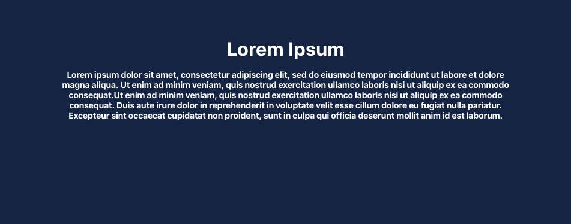
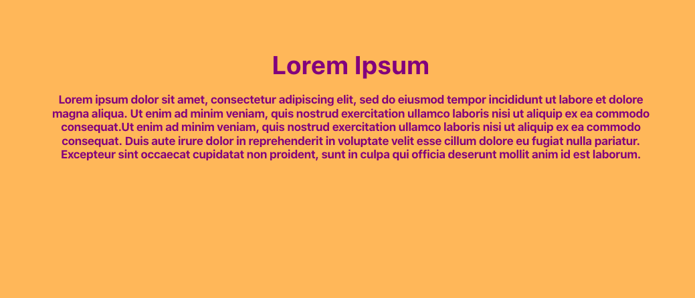

# mds-banner

# mckesson-design-system banner
A styled banner header and content

## Installation

### npm
```bash
npm i `@mcklabs/mds-banner` --save
```

### yarn
```bash
yarn add `@mcklabs/mds-banner`
```

### Rendered in the browser

<br/>

### Set the following variables in your imported SCSS/CSS file or html `style` tag, before usage
```css
:root {
--mdsBannerMaxWidth: 1024px;
--mdsBannerColor: purple;
--mdsBannerBackgroundColor: rgba(255, 166, 0, 0.783);
}
```

### Rendered in the browser

<br/>

```css
:root {
--mdsBannerBackgroundColor: orange;
--mdsBannerHeaderColor: darkgreen;
--mdsBannerHeaderMaxWidth: 320px;
--mdsBannerContentColor: white;
--mdsBannerContentMaxWidth: 320px;
}
```

### Rendered in the browser

<br/>

## Examples

```javascript

```

```html
### HTML
<mds-banner>
  <span slot="header">
    Lorem Ipsum
  </span>
  <span slot="content">
    Lorem ipsum dolor sit amet, consectetur adipiscing elit, sed do eiusmod tempor incididunt ut
    labore et dolore magna aliqua. Ut enim ad minim veniam, quis nostrud exercitation ullamco
    laboris nisi ut aliquip ex ea commodo consequat.
  </span>
  <span slot="content">
    Ut enim ad minim veniam, quis nostrud exercitation ullamco laboris nisi ut aliquip ex ea
    commodo consequat. Duis aute irure dolor in reprehenderit in voluptate velit esse cillum
    dolore eu fugiat nulla pariatur. Excepteur sint occaecat cupidatat non proident, sunt in culpa
    qui officia deserunt mollit anim id est laborum.
  </span>
</mds-banner>
```

```javascript
### React Component

import '
```

## Slots

| Name      | Description                           |
|-----------|---------------------------------------|
| `content` | The content slot inside an h4 element |
| `header`  | The header slot inside an h1 element  |

## CSS Custom Properties

| Property                     | Description                                      |
|------------------------------|--------------------------------------------------|
| `--mdsBannerBackgroundColor` | Overrides the background color for the header.   |
| `--mdsBannerColor`           | Overrides the text color for the banner.         |
| `--mdsBannerContentColor`    | Overrides the text color for the content.        |
| `--mdsBannerContentMaxWidth` | Overrides the max-width for the header.          |
| `--mdsBannerHeaderColor`     | Overrides the text color for the header.         |
| `--mdsBannerHeaderMaxWidth`  | Overrides the max-width for the header.          |
| `--mdsBannerMaxWidth`        | Overrides the maxwidth for the header and content. |
