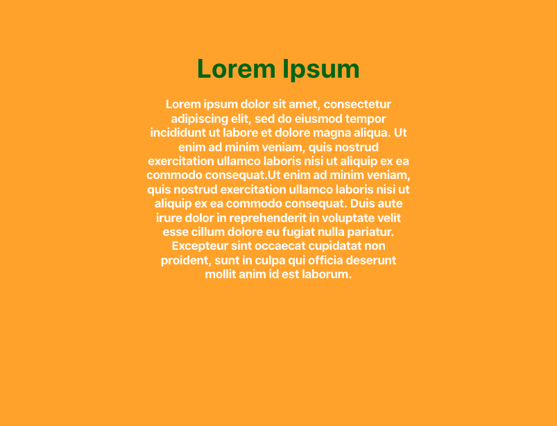

# mckesson-design-system banner
A styled banner header and content

## Installation

### npm
```bash
npm i @mcklabs/mds-banner --save
```

### yarn
```bash
yarn add @mcklabs/mds-banner
```

# API
<a name="module_MdsBanner"></a>

## MdsBanner ⇐ <code>HTMLElement</code>
Component to encapsulate the styling of a site banner

**Extends**: <code>HTMLElement</code>  
**Properties**

| Name | Type | Description |
| --- | --- | --- |
| slots | <code>Slots</code> | named slots for the consumer's content |
| header | <code>Slot</code> | The header slot inside an h1 element |
| content | <code>Slot</code> | The content slot inside an h4 element |
| CSSVariables | <code>enum</code> | below are the variables that can be overridden by css |
| --mdsBannerColor | <code>String</code> | Overrides the text color for the banner. |
| --mdsBannerBackgroundColor | <code>String</code> | Overrides the background color for the header. |
| --mdsBannerMaxWidth | <code>String</code> | Overrides the maxwidth for the header and content. |
| --mdsBannerHeaderColor | <code>String</code> | Overrides the text color for the header. |
| --mdsBannerHeaderMaxWidth | <code>String</code> | Overrides the max-width for the header. |
| --mdsBannerContentColor | <code>String</code> | Overrides the text color for the content. |
| --mdsBannerContentMaxWidth | <code>String</code> | Overrides the max-width for the header. |

**Example** *(HTML Usage)*  
```html
<mds-banner>
  <span slot="header">
    Lorem Ipsum
  </span>
  <span slot="content">
    Lorem ipsum dolor sit amet, consectetur adipiscing elit, sed do eiusmod tempor incididunt ut
    labore et dolore magna aliqua. Ut enim ad minim veniam, quis nostrud exercitation ullamco
    laboris nisi ut aliquip ex ea commodo consequat.
  </span>
  <span slot="content">
    Ut enim ad minim veniam, quis nostrud exercitation ullamco laboris nisi ut aliquip ex ea
    commodo consequat. Duis aute irure dolor in reprehenderit in voluptate velit esse cillum
    dolore eu fugiat nulla pariatur. Excepteur sint occaecat cupidatat non proident, sunt in culpa
    qui officia deserunt mollit anim id est laborum.
  </span>
</mds-banner>
```
**Example** *(React Component)*  
```jsx
import '@mcklabs/mds-banner'

export const banner = () => (
  <mds-banner>
    <span slot="header">
      Lorem Ipsum
    </span>
    <span slot="content">
      Lorem ipsum dolor sit amet, consectetur adipiscing elit, sed do eiusmod tempor incididunt ut
      labore et dolore magna aliqua. Ut enim ad minim veniam, quis nostrud exercitation ullamco
      laboris nisi ut aliquip ex ea commodo consequat.
    </span>
    <span slot="content">
      Ut enim ad minim veniam, quis nostrud exercitation ullamco laboris nisi ut aliquip ex ea
      commodo consequat. Duis aute irure dolor in reprehenderit in voluptate velit esse cillum
      dolore eu fugiat nulla pariatur. Excepteur sint occaecat cupidatat non proident, sunt in culpa
      qui officia deserunt mollit anim id est laborum.
    </span>
  </mds-banner>
)
```
**Example**  
### Rendered in the browser


<br/>
**Example**  
### Set the following variables in your imported SCSS/CSS file or html `style` tag, before usage
**Example**  
```css
:root {
  --mdsBannerMaxWidth: 1024px;
  --mdsBannerColor: purple;
  --mdsBannerBackgroundColor: rgba(255, 166, 0, 0.783);
}
```
**Example**  
### Rendered in the browser


<br/>
**Example**  
```css
:root {
  --mdsBannerBackgroundColor: orange;
  --mdsBannerHeaderColor: darkgreen;
  --mdsBannerHeaderMaxWidth: 320px;
  --mdsBannerContentColor: white;
  --mdsBannerContentMaxWidth: 320px;
}
```
**Example**  
### Rendered in the browser


<br/>
