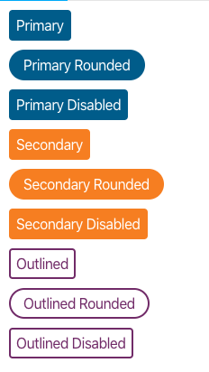

# mckesson-design-system button
A styled button

## Installation

### npm
```bash
npm i @mcklabs/mds-button --save
```

### yarn
```bash
yarn add @mcklabs/mds-button
```

# DOCS
<a name="module_MdsButton"></a>

## MdsButton ⇐ <code>HTMLElement</code>
A components that give you a `button` or `anchor` tag depending on the usage.

**Extends**: <code>HTMLElement</code>  

| Param | Type | Description |
| --- | --- | --- |
| href | <code>String</code> | give the button an href and it will render an `anchor` tag with the appropriate href instead of a `button` tag |
| disabled | <code>String</code> |  |

**Properties**

| Name | Type | Description |
| --- | --- | --- |
| CSSVariables | <code>enum</code> | below are the variables that can be overridden by css |
| --mdsBannerColor | <code>String</code> | Overrides the text color for the banner. |

**Example** *(HTML Usage)*  
```html
<mds-button variant="primary">Primary</mds-button>
<mds-button variant="primary rounded">Primary Rounded</mds-button>
<mds-button variant="primary" disabled>Primary Disabled</mds-button>
<mds-button variant="secondary">Secondary</mds-button>
<mds-button variant="secondary rounded" disabled="">Secondary Rounded</mds-button>
<mds-button variant="secondary" disabled>Secondary Disabled</mds-button>
<mds-button variant="outlined">Outlined</mds-button>
<mds-button variant="outlined rounded">Outlined Rounded</mds-button>
<mds-button variant="outlined" disabled>Outlined Disabled</mds-button>
```
**Example** *(React Component)*  
```jsx
import '@mcklabs/mds-button'

export const buttons = () => (
  <div>
    <mds-button variant="primary">Primary</mds-button>
    <mds-button variant="primary rounded">Primary Rounded</mds-button>
    <mds-button variant="primary" disabled>Primary Disabled</mds-button>
    <mds-button variant="secondary">Secondary</mds-button>
    <mds-button variant="secondary rounded" disabled="">Secondary Rounded</mds-button>
    <mds-button variant="secondary" disabled>Secondary Disabled</mds-button>
    <mds-button variant="outlined">Outlined</mds-button>
    <mds-button variant="outlined rounded">Outlined Rounded</mds-button>
    <mds-button variant="outlined" disabled>Outlined Disabled</mds-button>
  </div>
)
```
**Example** *(HTML Usage)*  
```html
<mds-button variant="primary" href="http://kittenwar.com">Rate Kittens</mds-button>
```
**Example**  
### Rendered in the browser


<br/>
**Example**  
### Set the following variables in your imported SCSS/CSS file or html `style` tag, before usage
**Example**  
```css
:root {
  --mdsBannerMaxWidth: 1024px;
  --mdsBannerColor: purple;
  --mdsBannerBackgroundColor: rgba(255, 166, 0, 0.783);
}
```
**Example**  
### Rendered in the browser


<br/>
