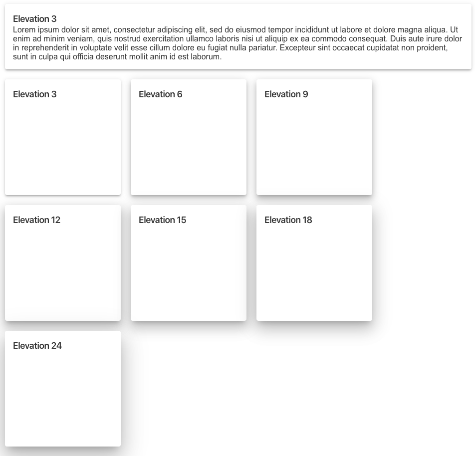
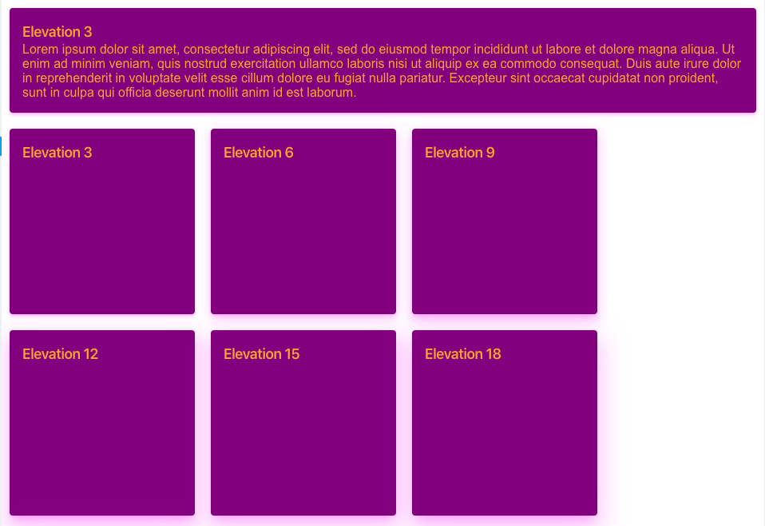

# mckesson-design-system paper
A styled paper that you can set the elevation property for more drastic effects.

## Installation

### npm
```bash
npm i @mcklabs/mds-paper --save
```

### yarn
```bash
yarn add @mcklabs/mds-paper
```

# DOCS
<a name="module_MdsPaper"></a>

## MdsPaper ⇐ <code>HTMLElement</code>
Styled component that has different elevations

**Extends**: <code>HTMLElement</code>  

| Param | Type | Default | Description |
| --- | --- | --- | --- |
| [elevation] | <code>String</code> | <code>&quot;1&quot;</code> | Sets the elevation for the accordion's internal [MdsPaper](../packages/paper) element |

**Properties**

| Name | Type | Description |
| --- | --- | --- |
| CSSVariables | <code>enum</code> |  |
| --mdsPaperBackgroundColor | <code>CSSVariable</code> | Overrides the icon color for the accordion indicator button. |
| --mdsPaperBoxShadowHOffsetColor | <code>CSSVariable</code> | Overrides the icon color for the accordion indicator button. |
| --mdsPaperBoxShadowVOffsetColor | <code>CSSVariable</code> | Overrides the icon color for the accordion indicator button. |
| --mdsPaperBoxShadowBlurColor | <code>CSSVariable</code> | Overrides the icon color for the accordion indicator button. |

**Example** *(HTML Usage)*  
```html
<mds-paper elevation="6">
  Lorem ipsum dolor sit amet, consectetur adipiscing elit, sed do eiusmod tempor incididunt ut
  labore et dolore magna aliqua. Ut enim ad minim veniam, quis nostrud exercitation ullamco
  laboris nisi ut aliquip ex ea commodo consequat. Duis aute irure dolor in reprehenderit in
  voluptate velit esse cillum dolore eu fugiat nulla pariatur. Excepteur sint occaecat
  cupidatat non proident, sunt in culpa qui officia deserunt mollit anim id est laborum.
</mwc-paper>
```
**Example** *(React Component)*  
```jsx
import '@mcklabs/mds-banner'

export const paper = () => (
  <mds-paper
    elevation={6}
  >
      Lorem ipsum dolor sit amet, consectetur adipiscing elit, sed do eiusmod tempor incididunt ut
      labore et dolore magna aliqua. Ut enim ad minim veniam, quis nostrud exercitation ullamco
      laboris nisi ut aliquip ex ea commodo consequat. Duis aute irure dolor in reprehenderit in
      voluptate velit esse cillum dolore eu fugiat nulla pariatur. Excepteur sint occaecat
      cupidatat non proident, sunt in culpa qui officia deserunt mollit anim id est laborum.
    </div>
  </mds-paper>
```
**Example**  
### Rendered in the browser


<br/>
**Example**  
### Set the following variables in your imported SCSS/CSS file or html `style` tag, before usage
**Example**  
```css
:root {
  --mdsPaperColor: orange;
  --mdsPaperBackgroundColor: purple;
  --mdsPaperBoxShadowHOffsetColor: rgba(255, 0, 255, 0.2);
  --mdsPaperBoxShadowVOffsetColor: rgba(255, 0, 255, 0.14);
  --mdsPaperBoxShadowBlurColor: rgba(255, 0, 255, 0.12);
}
```
**Example**  
### Rendered in the browser


<br/>
